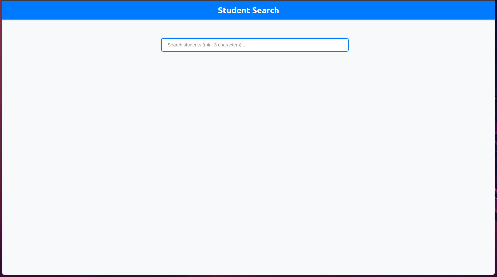
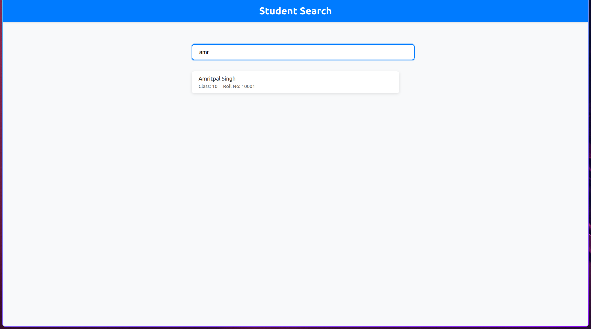

# Student Search Application

A full-stack application that implements a search bar with lazy loading functionality for student data. The application features a React frontend and a Node.js/Express backend.

## Features

- Search bar with lazy loading (triggers after 3 characters)
- Debounced search to optimize performance
- Responsive design for mobile and desktop
- Clean and modern UI
- RESTful API backend
- Case-insensitive search
- Maximum 5 results in dropdown
- Detailed student information display

## Screenshots

### Search Interface


### Search Results


## Tech Stack

### Frontend
- React.js
- Modern CSS
- Fetch API for HTTP requests

### Backend
- Node.js
- Express.js
- CORS enabled
- JSON file-based data storage

## Setup Instructions

### Prerequisites
- Node.js (v14 or higher)
- npm (v6 or higher)

### Backend Setup
1. Navigate to the backend directory:
   ```bash
   cd backend
   ```

2. Install dependencies:
   ```bash
   npm install
   ```

3. Start the backend server:
   ```bash
   npm start
   ```
   The server will run on http://localhost:5000

### Frontend Setup
1. Open a new terminal and navigate to the frontend directory:
   ```bash
   cd frontend
   ```

2. Install dependencies:
   ```bash
   npm install
   ```

3. Start the development server:
   ```bash
   npm start
   ```
   The application will open in your browser at http://localhost:3000

## Usage

1. Type at least 3 characters in the search bar to trigger the search
2. The dropdown will show up to 5 matching students
3. Click on a student to view their full details
4. The search is case-insensitive and works with partial matches

## API Endpoints

- `GET /api/search?query=<search_term>`: Search for students
- `GET /api/students`: Get all students (for testing)

## Performance Optimizations

- Debounced search (300ms delay)
- Lazy loading (3-character minimum)
- Limited results (5 maximum)
- Efficient search algorithm
- Responsive design for all screen sizes 